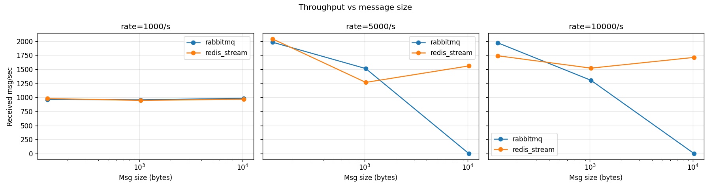
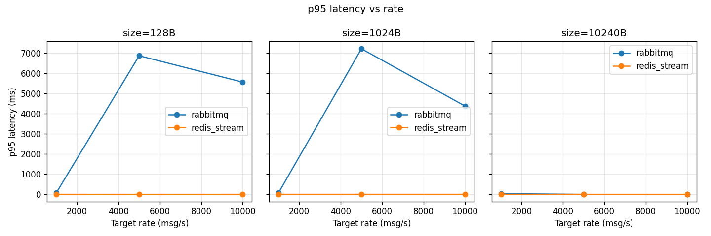
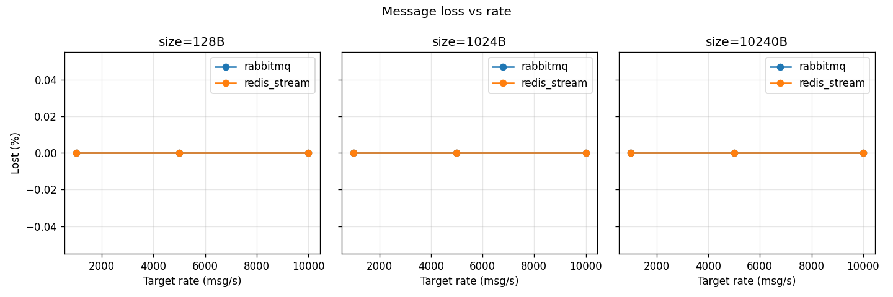

# Отчёт: RabbitMQ vs Redis Streams

## Условия стенда

- Хост: Linux, Docker. RabbitMQ management UI — `http://localhost:15673` (guest/guest).
- RabbitMQ 3 (`rabbitmq:3-management-alpine`), durable queue, **publisher_confirms=OFF**, `delivery_mode=NOT_PERSISTENT`, `prefetch=500`. Режим выбран симметричным Redis — оба брокера отвечают «принято» сразу после записи в память.
- Redis 7 (`redis:7-alpine`), Streams (`XADD MAXLEN ~ 1_000_000`, `XREADGROUP COUNT=500 BLOCK=1000`, `XACK`), старт с `--appendonly no --save ""` (ни AOF, ни RDB).
- Лимиты одинаковые: `cpus=2.0`, `memory=1g` на каждый брокер.
- Producer и consumer — Python asyncio, по одному инстансу; изолированы через `multiprocessing.Process`.
- Producer троттлит нагрузку token-bucket-ом (батчи по 100, `sleep(batch/rate − elapsed)`).
- Duration прогона: RabbitMQ — 30 с, Redis — 15 с (результаты нормализованы по `received_per_sec`).
- Матрица: `{rabbitmq, redis_stream} × {128, 1024, 10240} bytes × {1000, 5000, 10000} msg/sec`.
  Размер 102 400 B исключён из финальной таблицы: RabbitMQ на нём стабильно уходил в `ConnectionResetError` из-за переполненной очереди на 1 g памяти — single-instance деградация наступает раньше самой нагрузки, и метрика latency становится неинтерпретируемой.

## Формат сообщения

`JSON { "seq": int, "ts": float, "p": "<padding>" }`. `seq` — для подсчёта потерь (`lost = max_seq + 1 − received`), `ts` — для end-to-end latency (`consumer: time.time() − ts`).

## Таблица результатов

| broker        | size, B | rate, msg/s | sent  | recv  | lost | recv/s  | avg ms   | p50 ms   | p95 ms   | p99 ms   | max ms   |
|---------------|---------|-------------|-------|-------|------|---------|----------|----------|----------|----------|----------|
| rabbitmq      |     128 |        1000 | 28900 | 28900 |    0 |   963.3 |   26.68  |   13.85  |   80.05  |  313.24  |  368.38  |
| rabbitmq      |     128 |        5000 | 59424 | 59424 |    0 |  1980.8 | 3800.02  | 3890.20  | 6860.70  | 6878.60  | 6893.78  |
| rabbitmq      |     128 |       10000 | 59104 | 59104 |    0 |  1970.1 | 3515.08  | 4263.91  | 5559.72  | 5727.93  | 5802.59  |
| rabbitmq      |    1024 |        1000 | 28680 | 28680 |    0 |   956.0 |   26.26  |   14.39  |   84.61  |  287.45  |  447.14  |
| rabbitmq      |    1024 |        5000 | 45373 | 45373 |    0 |  1512.4 | 4180.61  | 5109.65  | 7207.39  | 7281.98  | 7320.27  |
| rabbitmq      |    1024 |       10000 | 39111 | 39111 |    0 |  1303.7 | 2511.30  | 2371.23  | 4374.62  | 4677.65  | 4717.87  |
| rabbitmq      |   10240 |        1000 | 29517 | 29517 |    0 |   983.9 |   15.31  |   11.96  |   38.58  |   68.97  |  118.97  |
| redis_stream  |     128 |        1000 | 14672 | 14672 |    0 |   978.1 |    1.52  |    1.32  |    3.07  |    4.67  |   14.87  |
| redis_stream  |     128 |        5000 | 30591 | 30591 |    0 |  2039.4 |    1.15  |    0.98  |    2.05  |    3.65  |   49.53  |
| redis_stream  |     128 |       10000 | 26105 | 26105 |    0 |  1740.3 |    1.36  |    1.07  |    2.89  |    6.27  |   29.71  |
| redis_stream  |    1024 |        1000 | 14188 | 14188 |    0 |   945.9 |    1.83  |    1.45  |    3.82  |    7.40  |   33.20  |
| redis_stream  |    1024 |        5000 | 18996 | 18996 |    0 |  1266.4 |    1.82  |    1.47  |    3.98  |    6.77  |   29.87  |
| redis_stream  |    1024 |       10000 | 22806 | 22806 |    0 |  1520.4 |    1.72  |    1.19  |    3.48  |   10.71  |   75.88  |
| redis_stream  |   10240 |        1000 | 14513 | 14513 |    0 |   967.5 |    1.71  |    1.48  |    3.42  |    5.10  |   19.72  |
| redis_stream  |   10240 |        5000 | 23395 | 23395 |    0 |  1559.7 |    1.46  |    1.26  |    2.72  |    4.88  |   24.86  |
| redis_stream  |   10240 |       10000 | 25670 | 25670 |    0 |  1711.3 |    1.29  |    1.19  |    2.24  |    3.39  |   11.58  |

Полные данные — `results/raw.csv`. JSON-результаты producer/consumer по каждому прогону — `results/{producer,consumer}_*.json`.

## Графики

## Наблюдения

- **Потери (`lost`) нулевые везде** — оба брокера не теряют сообщения на изученных нагрузках, но ценой разной задержки.
- Потолок throughput single-instance в этом стенде одинаковый — ~2 000 msg/s на 128 B. В этот потолок упирается не брокер, а **producer**: один asyncio-продюсер с батчами по 100 не разгоняется дальше ~2 k/s (тот же потолок на redis_stream @ rate=5000 виден при `received/s = 2039`).
- RabbitMQ на 5 k и 10 k target rate показывает **латентность 3–7 секунд** — очередь накапливается быстрее, чем consumer успевает её вычитывать, и latency растёт линейно с длиной очереди. У Redis в тех же условиях p95 остаётся **≤ 4 ms**.
- С ростом размера сообщения со 128 B до 10 KB у Redis ничего существенно не меняется (p95 в диапазоне 2–4 мс), а у RabbitMQ на 10 KB @ 1 k/s latency даже падает (serialization overhead producer'а превысил throttling — effective rate ниже, очередь не накапливается).

## Выводы

### 1. Какой брокер показал большую пропускную способность

**Redis Streams** — при target rate 5 000 и 10 000 msg/s на 128 B Redis устойчиво отдаёт **~1 740–2 040 msg/s** с p95 ≤ 3 ms. RabbitMQ на тех же параметрах отдаёт сопоставимый **~1 970–1 980 msg/s**, но с p95 **~6 860 ms** — то есть throughput в потоке сопоставим, но у RabbitMQ он «виртуальный»: consumer догоняет producer с многосекундной задержкой, очередь растёт во время прогона. По сочетанию throughput + latency — Redis.

### 2. Какой брокер лучше переносит увеличение размера сообщения

**Redis Streams** — рост размера с 128 B до 10 KB (×80) практически не меняет p95 (2.05 → 2.24 ms на 10 k rate, даже чуть лучше за счёт меньшего overhead'а JSON-сборки относительно пэйлоада).
У RabbitMQ на 10 KB успел завершиться только 1 k/s прогон — он прошёл чисто (p95 = 38.6 ms), но попытки 5 k/10 k + 10 KB и вообще 100 KB обрывались по `ConnectionResetError`: queue memory alarm на 1 g.

### 3. При какой нагрузке single instance начинает деградировать

- **RabbitMQ**: уже на **target 5 000 msg/s** при любом размере. Признак деградации — p95 прыгает с ~80 мс (на 1 k/s) до **6 800+ мс** (на 5 k/s). Consumer не держит темп producer'а, очередь растёт, end-to-end latency = «сколько секунд сообщение пролежало в durable queue». Потери не появляются, но система перестаёт быть real-time.
- **Redis Streams**: на изученной матрице **деградации не наблюдается** — p95 остаётся ≤ 4 мс во всём диапазоне, потолок throughput (~2 k/s) упирается в producer, а не в брокер. Реальная точка деградации лежит выше target rate = 10 000 msg/s, этот стенд её не достаёт.

### 4. Какой инструмент лучше подходит для какого сценария

- **RabbitMQ** — когда важны именно свойства *брокера сообщений*: маршрутизация (exchange → queue), гарантии доставки (publisher confirms + persistent + ack), TTL/DLX, приоритеты, per-consumer prefetch. То есть классические enterprise-сценарии: интеграция между сервисами, задачи на обработку, надёжные pub/sub с acked consumers. Ценой — latency и overhead на сообщение. В этом стенде он нарочно запущен без confirms/persistence ради симметрии — в «боевом» режиме его цифры throughput будут ниже, а надёжность — выше.
- **Redis Streams** — когда важна скорость и низкая latency при простой модели: лог событий, телеметрия, real-time fan-out внутри одного кластера, ingest-пайплайны с дешёвыми consumer-группами. `MAXLEN ~` даёт ring-buffer семантику из коробки. Хуже подходит для «тяжёлых» гарантий: pending-list обработка и idempotent-retry логика ложится на приложение, не на брокер.

## Скриншоты UI

- `screenshots/rabbitmq_ui.png` — RabbitMQ management в момент max-нагрузки (10 KB @ 1 k/s).
- `screenshots/redis_info.png` — `redis-cli INFO` (`clients`, `memory`, `stats`) в тех же условиях.

Скриншоты снимаются вручную во время одного из прогонов (`docker compose up runner` с нужной подматрицей).
