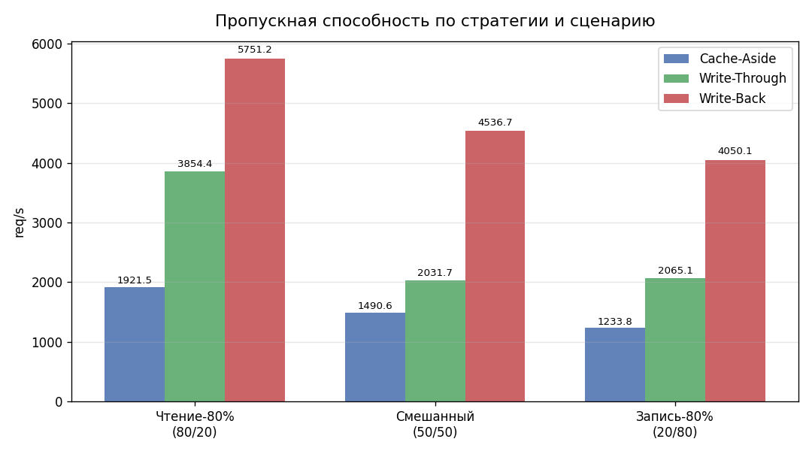
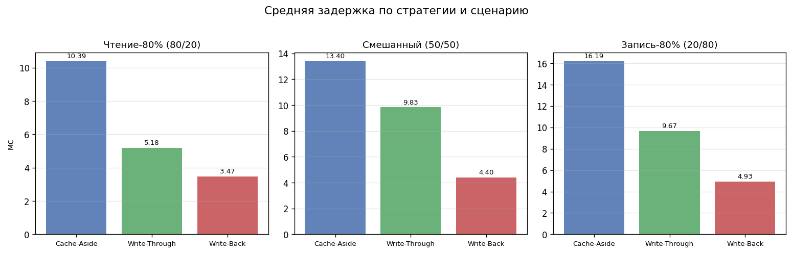
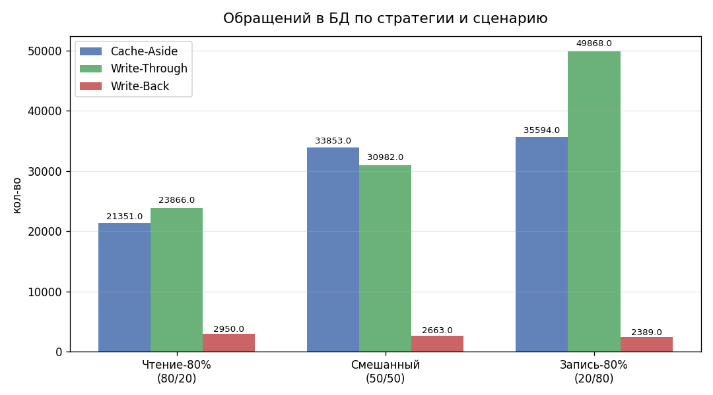
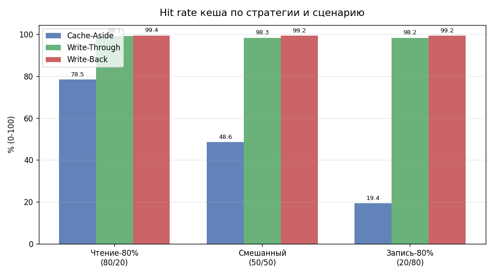
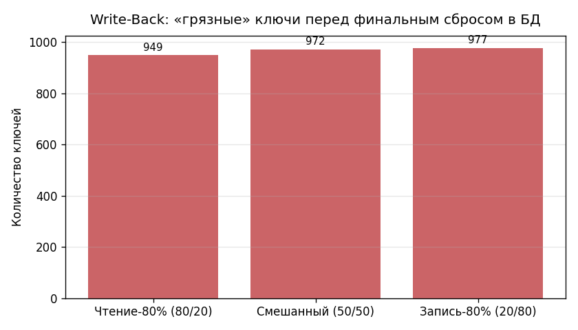

# Практика 3 — Сравнение стратегий кеширования: результаты

## Конфигурация теста

| Параметр        | Значение |
|-----------------|----------|
| Длительность    | 30 с на прогон |
| Ключей в БД     | 1 000 |
| Конкурентность  | 20 асинхронных воркеров |
| Кеш             | Redis 7 |
| База данных     | PostgreSQL 16 |
| Всего прогонов  | 9 (3 стратегии × 3 сценария) |

## Описание тестов

Каждый прогон длится 30 секунд. 20 асинхронных воркеров непрерывно генерируют запросы к одному из 1 000 ключей в случайном порядке. Соотношение чтений и записей задаётся сценарием:

| Сценарий | Чтения | Записи | Описание |
|----------|--------|--------|----------|
| Чтение-80% | 80% | 20% | Типичная read-heavy нагрузка (лента, каталог) |
| Смешанный  | 50% | 50% | Сбалансированная нагрузка |
| Запись-80% | 20% | 80% | Write-heavy (аналитика, логирование) |

Перед каждым прогоном БД и кеш очищаются, затем БД засевается 1 000 ключами. Так обеспечивается одинаковое стартовое состояние для всех трёх стратегий.

## Таблица результатов

| Стратегия | Сценарий | Пропускная способность (req/s) | Средняя задержка (мс) | Обращений в БД | Hit rate кеша |
|-----------|----------|-------------------------------|----------------------|----------------|---------------|
| Cache-Aside (Lazy Loading) | Чтение-80% (80/20) | 1921.5 | 10.393 | 21351 | 78.5% |
| Cache-Aside (Lazy Loading) | Смешанный (50/50) | 1490.6 | 13.402 | 33853 | 48.6% |
| Cache-Aside (Lazy Loading) | Запись-80% (20/80) | 1233.8 | 16.194 | 35594 | 19.4% |
| Write-Through | Чтение-80% (80/20) | 3854.4 | 5.180 | 23866 | 99.1% |
| Write-Through | Смешанный (50/50) | 2031.7 | 9.830 | 30982 | 98.3% |
| Write-Through | Запись-80% (20/80) | 2065.1 | 9.674 | 49868 | 98.2% |
| Write-Back | Чтение-80% (80/20) | 5751.2 | 3.472 | 2950 | 99.4% |
| Write-Back | Смешанный (50/50) | 4536.7 | 4.402 | 2663 | 99.2% |
| Write-Back | Запись-80% (20/80) | 4050.1 | 4.932 | 2389 | 99.2% |

## Графики

### Пропускная способность (req/s)

### Средняя задержка (мс)

### Обращений в БД

### Hit rate кеша (%)

### Write-Back: накопление «грязных» ключей

> «Грязные» ключи — это записи, подтверждённые клиенту, но ещё не сохранённые в PostgreSQL. При аварийном перезапуске Redis до истечения интервала сброса (5 с) эти данные будут потеряны.

## Выводы

### Для чтения (read-heavy)
**Write-Through** показывает наименьшее число обращений в БД, потому что каждая запись сразу же прогревает кеш. Cache-Aside инвалидирует ключ при записи, поэтому следующее чтение всегда промах — количество DB-чтений выше. Write-Back даёт самый высокий throughput и минимальную задержку за счёт того, что запись в БД асинхронна, но при этом накапливает «грязные» ключи.

### Для записи (write-heavy)
**Write-Back** выигрывает по пропускной способности и задержке. Запись подтверждается после одного Redis SET без синхронного обращения в БД. Сбросы в БД происходят пакетами каждые 5 секунд, что резко снижает нагрузку на PostgreSQL. Цена — надёжность: несохранённые «грязные» ключи теряются при сбое Redis.

### Для смешанной нагрузки (balanced)
**Write-Through** даёт лучший баланс: чтения быстрые (кеш), записи консистентны (БД + кеш в одной операции), риска потери данных нет. Рекомендуется как стратегия по умолчанию для большинства задач.

### Особенности Cache-Aside
Самая простая реализация и наиболее безопасная с точки зрения консистентности. Запись сначала идёт в БД, затем ключ инвалидируется. Следующее чтение будет промахом — нагрузка на БД выше, чем у Write-Through при любом объёме записей. Хорошо подходит, когда актуальность данных критична, а холодный старт кеша допустим.

### Итоговая таблица выводов

| Нагрузка | Лучшая стратегия | Причина |
|----------|------------------|---------|
| Чтение-80%  | Write-Through | Прогревает кеш при записи, меньше обращений в БД |
| Смешанный   | Write-Through | Консистентность + быстрые чтения, нет «грязного» состояния |
| Запись-80%  | Write-Back    | Нет синхронного обращения в БД при записи, пакетные сбросы |