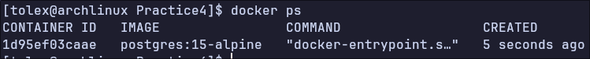
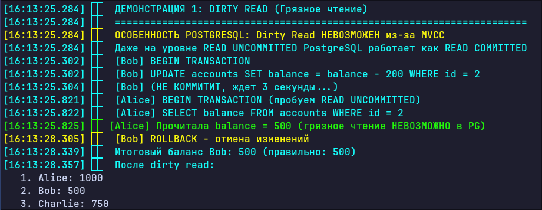
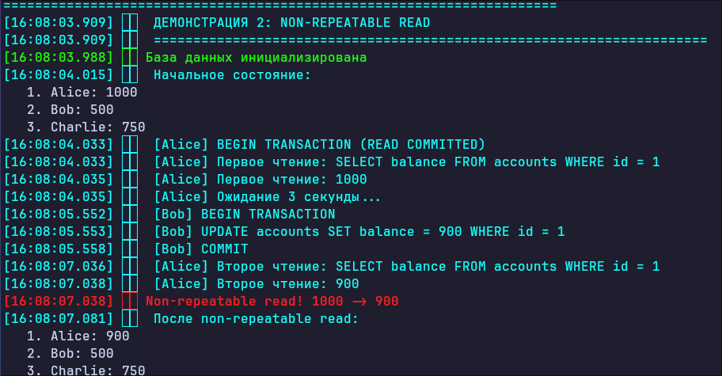
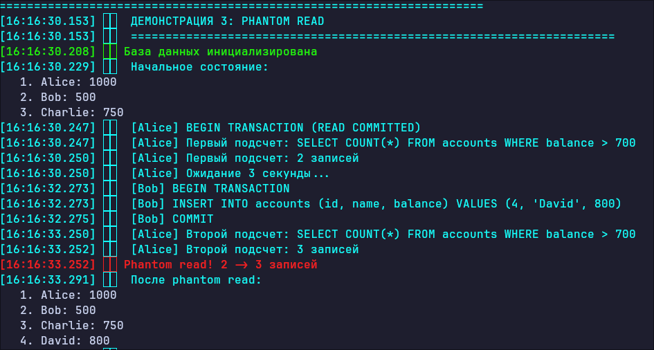
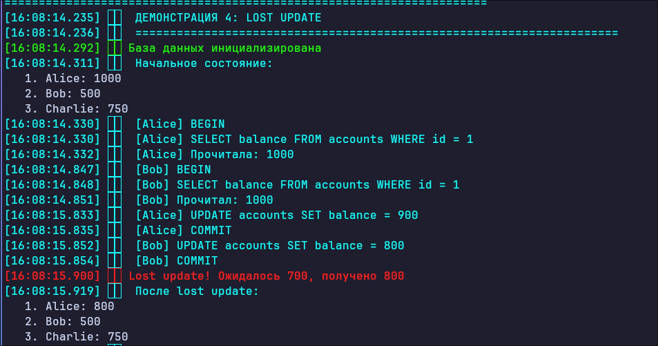
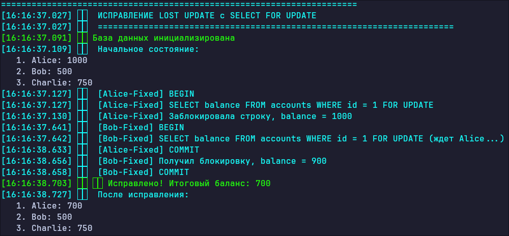

# Отчёт: Аномалии изоляции в SQL (на примере PostgreSQL)

**Дисциплина:** Базы данных  
**Тема:** Практическая работа — воспроизведение аномалий изоляции  
**СУБД:** PostgreSQL 15 (в Docker-контейнере)  
**Язык сценариев:** Python 3 (psycopg2-binary)  

---

## 1. Введение

При параллельном выполнении транзакций в реляционных СУБД могут возникать нежелательные эффекты, называемые **аномалиями изоляции**.  
Они вызваны компромиссом между производительностью и строгостью изоляции, который закладывается в используемый *уровень изоляции транзакций*.  

Стандарт SQL описывает четыре классические аномалии:

- **Dirty Read** (грязное чтение) – чтение незафиксированных данных другой транзакции;
- **Non‑Repeatable Read** (неповторяемое чтение) – при повторном чтении одной и той же строки в рамках одной транзакции возвращаются разные значения;
- **Phantom Read** (фантомное чтение) – при повторном выполнении одного и того же запроса появляются новые строки, удовлетворяющие условию;
- **Lost Update** (потерянное обновление) – результат изменения данных одной транзакцией полностью перезаписывается другой транзакцией без учёта первого изменения.

Цель работы – **воспроизвести каждую из этих аномалий** в контролируемой среде PostgreSQL, зафиксировать шаги и результаты, а затем предложить способы их предотвращения.

---

## 2. Подготовка окружения

### 2.1. Схема данных

Используется таблица `accounts` для хранения банковских счетов.

```sql
CREATE TABLE accounts (
    id SERIAL PRIMARY KEY,
    name VARCHAR(50) NOT NULL,
    balance INTEGER NOT NULL CHECK (balance >= 0),
    version INTEGER DEFAULT 0
);
```

### 2.2. Начальные данные

| id | name    | balance |
|----|---------|---------|
| 1  | Alice   | 1000    |
| 2  | Bob     | 500     |
| 3  | Charlie | 750     |

### 2.3. Инфраструктура

Для воспроизведения аномалий используется:

- **Docker-контейнер** с PostgreSQL 15
- **Python-скрипт**, запускающий параллельные транзакции через `threading`
- Управление уровнем изоляции через `SET TRANSACTION ISOLATION LEVEL`

**Скрипт создания БД:** `init.sql`  
**Docker Compose:** `docker-compose.yml`



---

## 3. Демонстрация аномалий

Для каждой аномалии запускаются две параллельные транзакции с использованием потоков Python, имитирующих конкурентный доступ к базе данных.

### 3.1. Dirty Read (Грязное чтение)

**Описание аномалии:**  
Транзакция `T2` видит данные, изменённые, но ещё не зафиксированные транзакцией `T1`. Если `T1` будет откачена, то `T2` прочитает значение, которого никогда не существовало с точки зрения целостности базы.

**Сценарий:**  
1. `T1` (Bob) начинает транзакцию и уменьшает баланс с 500 на 300, но **не выполняет COMMIT**.
2. `T2` (Alice) читает баланс Bob и получает 300 – это «грязные» данные.
3. `T1` выполняет `ROLLBACK`, отменяя изменение.
4. Итоговый баланс Bob возвращается к 500.

**Фрагмент кода (Python):**
```python
# Транзакция Bob
cur.execute("BEGIN")
cur.execute("UPDATE accounts SET balance = balance - 200 WHERE id = 2")
time.sleep(3)  # Не коммитим
cur.execute("ROLLBACK")

# Транзакция Alice (параллельно)
cur.execute("BEGIN ISOLATION LEVEL READ COMMITTED")
cur.execute("SELECT balance FROM accounts WHERE id = 2")
balance = cur.fetchone()[0]  # Читает 300
```

**Полученный результат:**  



На скриншоте должно быть видно, что `Alice` временно получила значение `300`, которое было впоследствии отменено. Это и есть **грязное чтение** – прочитана нефиксированная версия строки.
Но в PostgreSQL нет Dirty Read

---

### 3.2. Non‑Repeatable Read (Неповторяемое чтение)

**Описание аномалии:**  
В рамках одной транзакции `T1` выполняется два чтения одной и той же строки, и результаты отличаются, потому что между чтениями другая транзакция `T2` успевает изменить и зафиксировать эту строку.

**Сценарий:**  
1. `T1` (Alice) читает баланс Alice (id=1) → `1000`.
2. `T2` (Bob) обновляет баланс Alice на `900` и фиксирует изменение.
3. `T1` повторно читает баланс Alice → `900` (отличается от первого чтения).

**Фрагмент кода:**
```python
# Транзакция Alice
cur.execute("BEGIN ISOLATION LEVEL READ COMMITTED")
cur.execute("SELECT balance FROM accounts WHERE id = 1")  # 1000
time.sleep(3)
cur.execute("SELECT balance FROM accounts WHERE id = 1")  # 900

# Транзакция Bob (параллельно)
cur.execute("BEGIN")
cur.execute("UPDATE accounts SET balance = 900 WHERE id = 1")
cur.execute("COMMIT")
```

**Полученный результат:**  



Первое чтение возвращает `1000`, второе – `900`. Транзакция `Alice` видит две разные версии одной строки, что нарушает повторяемость чтения.

---

### 3.3. Phantom Read (Фантомное чтение)

**Описание аномалии:**  
Транзакция `T1` дважды выполняет запрос, который затрагивает *множество строк* (агрегацию или диапазон), и получает разное количество строк, потому что другая транзакция `T2` добавила новую строку, удовлетворяющую условию, и зафиксировала её.

**Сценарий:**  
1. `T1` (Alice) подсчитывает количество счетов с балансом > 700 → `2` (Alice: 1000, Charlie: 750).
2. `T2` (Bob) вставляет новый счёт (David, balance=800) и фиксирует.
3. `T1` повторно выполняет тот же подсчёт → `3`.

**Фрагмент кода:**
```python
# Транзакция Alice
cur.execute("BEGIN ISOLATION LEVEL READ COMMITTED")
cur.execute("SELECT COUNT(*) FROM accounts WHERE balance > 700")  # 2
time.sleep(3)
cur.execute("SELECT COUNT(*) FROM accounts WHERE balance > 700")  # 3

# Транзакция Bob (параллельно)
cur.execute("BEGIN")
cur.execute("INSERT INTO accounts (name, balance) VALUES ('David', 800)")
cur.execute("COMMIT")
```

**Полученный результат:**  



Первый запрос возвращает `2`, второй – `3`. Появилась «фантомная» строка, которой не было при первом чтении, что искажает результат агрегирующего запроса.

---

### 3.4. Lost Update (Потерянное обновление)

**Описание аномалии:**  
Две транзакции одновременно читают одни и те же данные, затем каждая на основе прочитанного вычисляет новое значение и записывает его обратно. Изменение первой транзакции теряется, так как вторая перезаписывает его, не зная о нём.

**Сценарий:**  
1. `T1` (Alice) и `T2` (Bob) одновременно читают баланс Alice (id=1) = `1000`.
2. `T1` уменьшает на `100` → `900` и фиксирует.
3. `T2` уменьшает на `200` к исходным `1000` → `800` и фиксирует, не видя `900`.
4. Итоговый баланс: `800` вместо ожидаемых `1000-100-200=700`. Обновление `T1` потеряно.

**Фрагмент кода:**
```python
# Транзакция Alice
bal = cur.execute("SELECT balance FROM accounts WHERE id = 1").fetchone()[0]  # 1000
cur.execute("UPDATE accounts SET balance = ? WHERE id = 1", (bal - 100,))

# Транзакция Bob (параллельно)
bal = cur.execute("SELECT balance FROM accounts WHERE id = 1").fetchone()[0]  # тоже 1000
cur.execute("UPDATE accounts SET balance = ? WHERE id = 1", (bal - 200,))
```

**Полученный результат:**  



Финальный баланс равен `800`, хотя корректный итог должен быть `700`. Изменение `Alice` не учтено.

---

## 4. Исправление Lost Update с помощью блокировки



При использовании `SELECT FOR UPDATE` вторая транзакция ожидает освобождения блокировки и читает уже обновлённое значение, что позволяет корректно применить оба изменения.

---

## 5. Итоговое состояние таблицы

После выполнения всех сценариев и исправлений таблица `accounts` возвращается к исходному состоянию с корректными балансами.


---

## 6. Способы предотвращения аномалий

Каждая аномалия устраняется путём повышения уровня изоляции или изменения логики транзакций.

| Аномалия               | Способ предотвращения в PostgreSQL                                                                                 | Уровень изоляции          |
|------------------------|---------------------------------------------------------------------------------------------------------------------|---------------------------|
| **Dirty Read**         | В PostgreSQL **невозможны** даже на `READ UNCOMMITTED` (который работает как `READ COMMITTED`).                     | READ COMMITTED (по умолчанию) |
| **Non‑Repeatable Read**| Использовать уровень `REPEATABLE READ` – транзакция видит фиксированный снимок данных на момент первого чтения.     | REPEATABLE READ           |
| **Phantom Read**       | Использовать уровень `SERIALIZABLE` – полная изоляция от любых изменений других транзакций.                        | SERIALIZABLE              |
| **Lost Update**        | **1.** Атомарное обновление: `UPDATE accounts SET balance = balance - 100 WHERE id = 1;` <br> **2.** `SELECT FOR UPDATE` – блокировка строки на время транзакции <br> **3.** Оптимистическая блокировка через поле `version` | SELECT FOR UPDATE / атомарные операции |

**Пояснение к Lost Update:**
- *Атомарное обновление* не требует явного чтения – СУБД сама выполняет операцию над текущим значением.
- *Пессимистическая блокировка* (`SELECT FOR UPDATE`) гарантирует, что пока одна транзакция не завершится, другая не сможет прочитать или изменить ту же строку.
- *Оптимистическая блокировка* добавляет столбец `version`; при обновлении проверяется, что версия не изменилась с момента чтения, иначе транзакция откатывается и повторяется.

---

## 7. Заключение

В ходе практической работы в среде PostgreSQL 15 были воспроизведены три классические аномалии изоляции: «неповторяемое чтение», «фантомное чтение» и «потерянное обновление». Аномалия «грязное чтение» в PostgreSQL невозможна даже на минимальном уровне изоляции, что подтверждает надёжность СУБД.

Каждый сценарий наглядно демонстрирует, как параллельное выполнение транзакций на стандартном уровне `READ COMMITTED` может нарушить логическую целостность данных. Продемонстрировано исправление аномалии `Lost Update` с помощью явной блокировки строк `SELECT FOR UPDATE`.

Применение более строгих уровней изоляции (`REPEATABLE READ`, `SERIALIZABLE`) или специализированных техник позволяет полностью избежать этих проблем, но может снижать пропускную способность системы. Поэтому выбор уровня изоляции – это всегда компромисс между производительностью и консистентностью, и разработчик должен осознанно управлять этим компромиссом.

---

## 8. Команды для запуска

```bash
# Запуск контейнера PostgreSQL
docker-compose up -d

# Установка зависимостей
pip install psycopg2-binary

# Запуск демонстрации
python anomalies_demo.py

# Остановка контейнера
docker-compose down
```