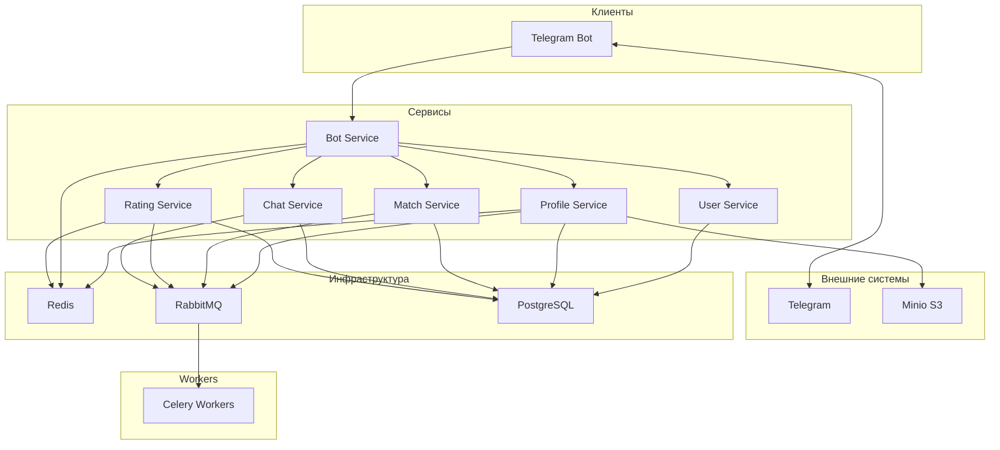
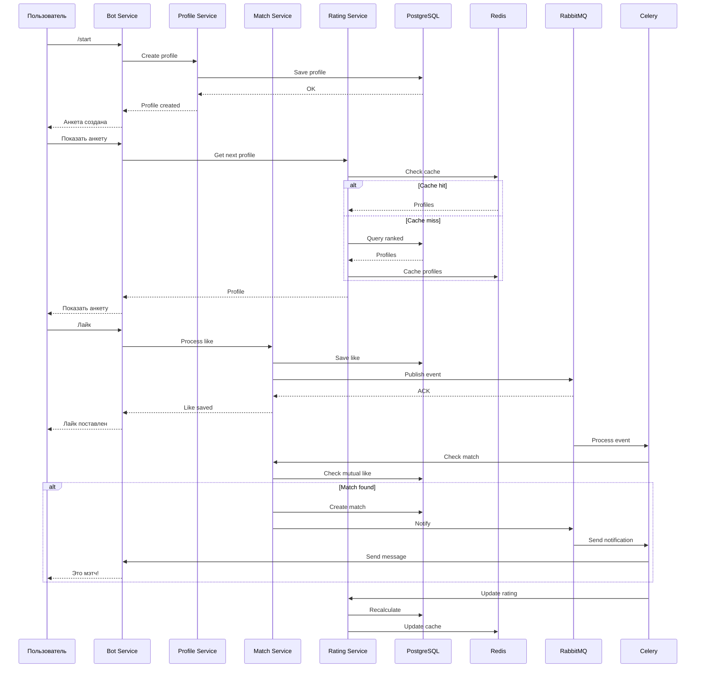

# Архитектура системы

## Обзор

Dating Bot построен на микросервисной архитектуре с использованием RabbitMQ для асинхронного взаимодействия между сервисами.

## Схема архитектуры (Mermaid)

## Потоки данных

## Сервисы

### Bot Service
Обработка команд Telegram, интерфейс пользователя, отправка уведомлений о мэтчах и сообщениях.

### User Service
Управление пользователями Telegram: регистрация, профиль, настройки.

### Profile Service
CRUD операции с анкетами: создание, редактирование, поиск, загрузка фотографий в S3.

### Match Service
Обработка лайков, проверка взаимных лайков, создание мэтчей, отправка уведомлений.

### Chat Service
Управление чатами между пользователями, отправка и получение сообщений.

### Rating Service
Расчёт рейтингов (3 уровня), ранжирование анкет, кэширование отсортированных списков.

| Сервис | Порт |
|--------|------|
| Bot Service | 8001 |
| User Service | 8002 |
| Profile Service | 8003 |
| Match Service | 8004 |
| Chat Service | 8005 |
| Rating Service | 8006 |

## Технологический стек

| Компонент | Технология |
|-----------|-------------|
| Backend | Python FastAPI |
| Bot | python-telegram-bot |
| Database | PostgreSQL |
| Cache | Redis |
| Queue | RabbitMQ |
| Tasks | Celery |
| Storage | Minio (S3) |
| Gateway | Nginx |

## Взаимодействие

- **Синхронное**: REST API через Nginx Gateway
- **Асинхронное**: RabbitMQ → Celery Workers

## Масштабирование

- Горизонтальное масштабирование сервисов
- Redis для кэширования
- RabbitMQ для балансировки нагрузки
