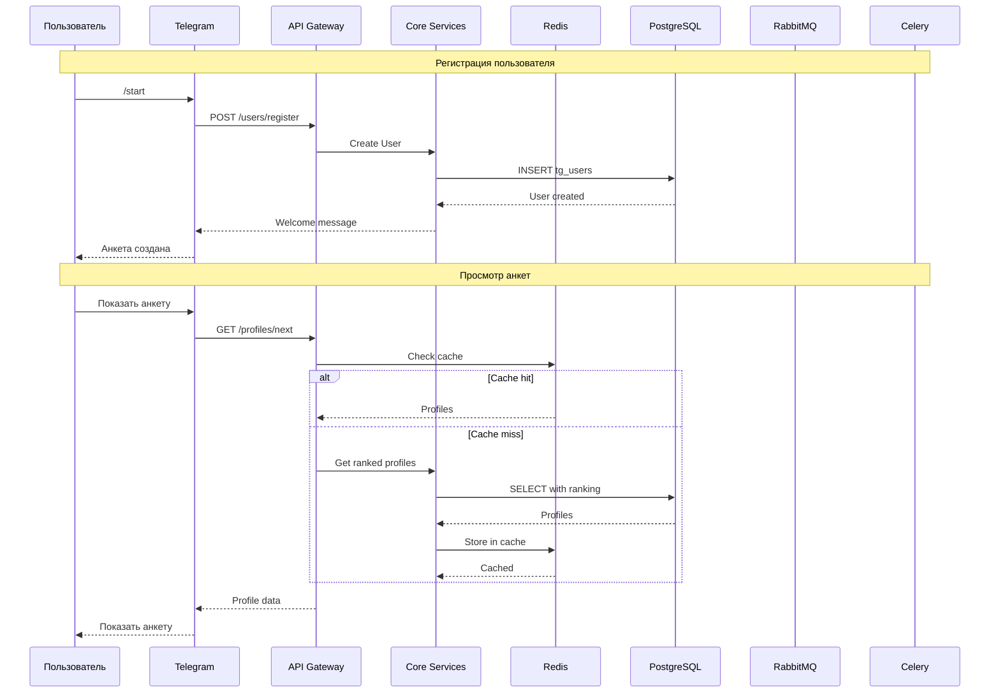

# Архитектура системы

## Обзор

Dating Bot построен на микросервисной архитектуре с использованием очередей сообщений для асинхронного взаимодействия между сервисами.

## Схема архитектуры (Mermaid)

```mermaid
flowchart TB
    subgraph External["Внешние системы"]
        TG["Telegram API"]
        S3["Minio S3"]
    end

    subgraph Client["Клиент"]
        BotClient["Telegram Bot"]
    end

    subgraph Gateway["API Gateway"]
        Nginx["Nginx Load Balancer"]
    end

    subgraph CoreServices["Основные сервисы"]
        subgraph BotService["Bot Service"]
            BotAPI["Bot API"]
            BotHandler["Message Handler"]
        end
        
        subgraph UserService["User Service"]
            UserAPI["User API"]
            UserRepo["User Repository"]
        end
        
        subgraph ProfileService["Profile Service"]
            ProfileAPI["Profile API"]
            ProfileRepo["Profile Repository"]
        end
        
        subgraph MatchService["Match Service"]
            MatchAPI["Match API"]
            MatchEngine["Match Engine"]
        end
        
        subgraph ChatService["Chat Service"]
            ChatAPI["Chat API"]
            ChatRepo["Chat Repository"]
        end
        
        subgraph RatingService["Rating Service"]
            RatingAPI["Rating API"]
            RatingEngine["Rating Engine"]
        end
    end

    subgraph MessageBroker["Message Broker (RabbitMQ)"]
        Queue1["user.events"]
        Queue2["match.events"]
        Queue3["rating.events"]
        Queue4["notification.events"]
    end

    subgraph AsyncWorkers["Async Workers (Celery)"]
        RatingWorker["Rating Worker"]
        NotificationWorker["Notification Worker"]
        CleanupWorker["Cleanup Worker"]
    end

    subgraph Cache["Cache Layer (Redis)"]
        Redis1["Profile Cache"]
        Redis2["Session Cache"]
        Redis3["Rating Cache"]
        Redis4["Queue Broker"]
    end

    subgraph Database["Database Layer (PostgreSQL)"]
        PG1["tg_users"]
        PG2["profiles"]
        PG3["photos"]
        PG4["likes"]
        PG5["matches"]
        PG6["chats"]
        PG7["messages"]
        PG8["ratings"]
        PG9["referrals"]
    end

    %% Client to Bot
    Client --> BotClient
    BotClient <--> TG
    
    %% Bot to Gateway
    BotClient --> Nginx
    
    %% Gateway to Services
    Nginx --> BotAPI
    Nginx --> UserAPI
    Nginx --> ProfileAPI
    Nginx --> MatchAPI
    Nginx --> ChatAPI
    Nginx --> RatingAPI
    
    %% Services to Database
    UserRepo --> PG1
    ProfileRepo --> PG2
    ProfileRepo --> PG3
    MatchEngine --> PG4
    MatchEngine --> PG5
    ChatRepo --> PG6
    ChatRepo --> PG7
    RatingEngine --> PG8
    
    %% Services to Cache
    ProfileAPI --> Redis1
    BotAPI --> Redis2
    RatingAPI --> Redis3
    Celery --> Redis4
    
    %% Services to Message Broker
    BotHandler --> Queue1
    MatchEngine --> Queue2
    RatingEngine --> Queue3
    ChatAPI --> Queue4
    
    %% Message Broker to Workers
    Queue1 --> RatingWorker
    Queue2 --> NotificationWorker
    Queue3 --> RatingWorker
    Queue4 --> NotificationWorker
    
    %% Workers to Services
    RatingWorker --> RatingEngine
    NotificationWorker --> BotHandler
    
    %% S3 Storage
    ProfileAPI --> S3
```

## Потоки данных

## Компоненты системы

### 1. Bot Service
- Обработка команд Telegram
- Интерфейс пользователя
- Отправка уведомлений

### 2. User Service
- Управление пользователями
- Регистрация и аутентификация

### 3. Profile Service
- CRUD операции с анкетами
- Управление фотографиями
- Интеграция с S3

### 4. Match Service
- Обработка лайков
- Проверка взаимных лайков
- Создание мэтчей

### 5. Chat Service
- Управление чатами
- Отправка/получение сообщений

### 6. Rating Service
- Расчёт рейтингов (3 уровня)
- Ранжирование анкет
- Обновление через Celery

## Технологический стек

| Компонент | Технология | Назначение |
|-----------|------------|------------|
| Backend | Python FastAPI | REST API |
| Bot | python-telegram-bot | Telegram интеграция |
| Database | PostgreSQL | Основное хранилище |
| Cache | Redis | Кэширование, сессии |
| Queue | RabbitMQ | Асинхронные сообщения |
| Tasks | Celery | Фоновые задачи |
| Storage | Minio | S3 для фото |
| Nginx | Reverse Proxy | Балансировка |

## Взаимодействие сервисов

### Синхронное (REST)
- Client → API Gateway → Core Services → Database

### Асинхронное (MQ)
- Services → RabbitMQ → Celery Workers
- Workers → Services → Database

## Масштабирование

- **Горизонтальное**: несколько инстансов каждого сервиса
- **Вертикальное**: увеличение ресурсов PostgreSQL и Redis
- **Кэширование**: Redis для снижения нагрузки на БД
- **Очереди**: RabbitMQ для асинхронной обработки
